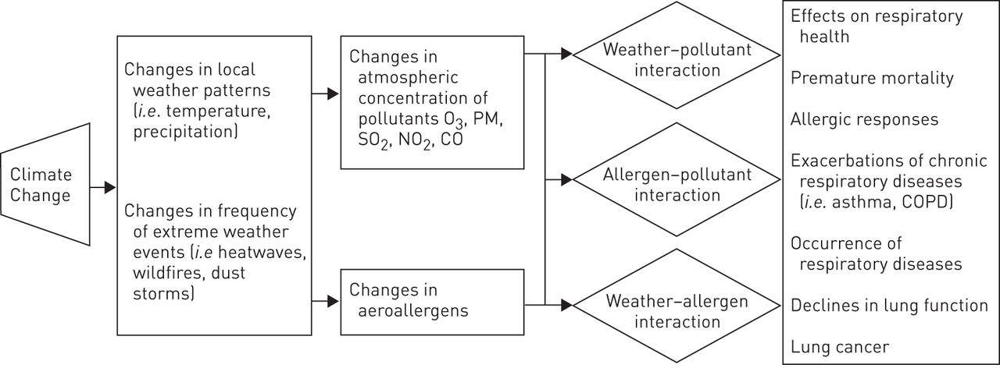

# The Power of Virtual Reality: Investigating the Correlation Between Climate Change and Neonatal Health and Survival in Nicragua
## Abstract
Can an emerging techology like virtual reality (VR) assist with the analysis, understanding, and storytelling of data?
Climate change is having extreme impacts on the Nicaraguan people which is limiting human development. Nicaragua is experiencing both high temperatures and droughts combined with flooding. Another issue in Nicaragua is neonatal health and survival. The effects of a changing environment could potentially have a negative impact on pregnant women and their children. This study levergaes D6 VR software to more thouroughly investigate climate change and neonatal health and survival in Nicaragua. By investigating the futures of children, VR assited in the discovery and sharing of results. But, how can VR be used with data science and data visualization? How can this newer software be utilized to illustrate the correlation of climate change and neonatal health in Nicaragua? The goal is for more people to understand the data and correlations. By making this data more accesable for people to actively interact with the data, change is more likely to occur where it is needed.

## Introduction
With climate change being a critical and concerning topic today, how is climate change affecting future generations? More specifically, how would this affect a developing country such as Nicaragua?

By focusing the support on local ownership, political reconciliation, consensus decision-making, social and gender equity, an environmental and public health perspective, and sustainability, Blandon and all were able to observe a positive shift in poverty and health in the North-West region in Nicaragua. “During the last decade, the proportion of individuals living in poverty was reduced from 79 to 47%. Primary school enrolment increased from 70 to 98% after the start of the school breakfast program. Under-five mortality was around 50 per 1,000 live births in 1990 and again peaked after Hurricane Mitch and was approaching 20 per 1,000 in 2014.” 

Technology is around us every second of every day. It is also constantly updating and improving. Because of advances in hardware, procesing and networking, VR is a viable tool to support the analysis of data. VR has found a home in emersive gaming environments. It is now being taken seriously in research and industry appliction. One company, D6, belives VR can take data visualization to the next level of storytelling and support the discovry of trend much faster than origonal algorithmic analysis. Virtual reality allows users to interact with the data using drag and drop techniques and the added advantage of being able to walk around the data in six demensions. Adding more dimensions allows for more variables to be compared and analyzed. 

The climate and health data was both averaged for the decades of 1990, 2000, and 2010. The data does not just focus on Nicaragua due to a lack of data on lower administrative levels. The countries included are the central American countries, Belize, Costa Rica, El Salvador, Guatemala, Honduras, Nicaragua, and Panama, as well as the U.S. and Mexico. 

## Climate Change Factors
The initial climate data considered included average CO2 metric tons per capita,	average renewable energy consumption (% of total final energy consumption), average % of greenhouse gas emmisions change from 1990,	average arable land (% of land coverage),	average % of population exposed to toxic air polution, average CO2 damage (% of GNI), average net forest depletion (% of GNI),	average mineral depletion (% of GNI),	average particulate emmisions damage (% of GNI), and climate change risk index. Only used for analysis were the following data points: average CO2 damage (% of GNI), average % of population exposed to toxic air polution, and average particulate emmisions damage (% of GNI). Out of the data, these factors appeared to be the best to use. The three climate variables used in D6 will be discussed later.

When looking at the climate data collected, both U.S. and Mexico CO2 per capita were outliers. Both countries had data that were dramatically larger than the data for the Central American countries. To keeping the unit of measurement the same between climate factors, data units were normalized asa percentage of GNI.  The damage percent of the GNI is the cost of damage to a country's income. The net forest depletion (% of GNI), according to Index Mundi, is "the product of unit resource rents and the excess of roundwood harvest over natural growth." A high percentage means there is a higher destruction of forest. The mineral depletion is the similar in that a higher percentage means higher depletion in mineral resources.

The Climate Risk Index is a very interesting and important calculation. This risk index looks at the damage caused by extreme weather. It compares fatalities, fatalities per 100,000 people, losses in US$ million Purchasing Power Parties (PPP), and losses per unit Gross Domestic Product (GDP). Acording to Germanwatch, "each country's index score has been derived from a country's average ranking in all four indicating categories, according to the following weighting: death toll, 1/6; deaths per 100,000 inhabitants, 1/3; absolute losses in PPP, 1/6; losses per GDP unit, 1/3." Climate change is less seen in the day-to-day changes in temperature, rain fall, etc. but rather in the incidences of extreme weather. The Climate Risk Index focuses on the extreme wether conditions, which is a better representation of climate change. This data was hard to compare to the other I had due to the years in which the ranks were designated.

| Country    | Climate Risk Index 1995-2004 | Climate Risk Index 2004 | Climate Risk Index 2017 |
|------------|------------------------------|-------------------------|-------------------------|
|Belize      |                            33|N/A                      |124                      |
|Costa Rica  |                            56|101                      |21                       |
|El Salvador |                            37|104                      |98                       |
|Guatemala   |                            48|108                      |73                       |
|Honduras    |                             1|N/A                      |34                       |
|Nicaragua   |                             5|53                       |25                       |
|Panama      |                            91|36                       |77                       |
|U.S.        |                            23|9                        |12                       |
|Mexico      |                            25|49                       |64                       |

In the chart above, Hondurous was most impacted by extreme wether conditions from 1995-2004. Most of the countries increased in ranking either as a result in more extreme weather elsewhere or lessening impact of extreme wether in their country.

## Health Factors
Other data collected were health factors: average under 5 mortality rate per 1,000 live births,	average neonatal mortality rate per 1,000 live births,	average infant mortality rate per 1,000 live births, maternal mortality rate per 1,000 live births,	average % of children receiving diarrhea treatment,	average % of anemia among women (14-49), average % of anemia among children under five,	average % of anemia among pregnant women,	average % women receiving prenatal care, average % of births attened by skilled staff, and average nurses and midwives per 1,000 people. Analysis found the following data points to be of most interest: neonatal mortality, maternal mortality, births attended by skilled staff, and average midwives.

Data that represented both neonatal mortality and data that represents health and surival down the road required the use of percentage of children recieving diarrea treatment. Diarrhea is very representative of childrens health. Diarrhea can be caused by drinking contaminted water and food. If a family is displaced due to extreme weather, they may end up in a situation which does not allow for them to have access to clean drinking water. Unfortunatly, analysis did not indicate a strong correlation between diarrhea treatment and neonatal mortality. In exploring future health, collected data on anemia was analyzed. Anemia can be a result of having a low iron diet. There was a slight correlation between anemia in children and neonatal mortality. The R-squared value was 0.6119 in the 1990's, 0.6980 in the 2000's, and 0.6774 in the 2010's. While future analysis could include this demension, but for this study was not added to the VR data visualization exploration.

## Correlation between Climate Change and Neonatal Survival
Using D6 VR software the correlation analysis was preformed on average CO2 damage (% of GNI), average % of population exposed to toxic air polution, average particulate emmisions damage (% of GNI), neonatal mortality, maternal mortality, and births attended by skilled staff or average midwives. The three videos show what these graphs looked like in D6. There is a recording for each decade. 

From within D6 VR the correlation between neonatal mortality and particulate emmisions damage became evident. After looking more into particulate emmisions, climate change can escalate particulate emmisions and particuate emmisions can cause harm to one's health. The figure below was posted in a research paper conducted by De Sario, Katsouyanni, and Michelozzi. 

The figure illustrates both the effects of climate change on particulate emmisions and the effects of particulate emmisions on health.

The virtual reality graphs all have the x-value as neonatal mortality, the y-value as particulate emmisions damages, the height as % of the population exposed to toxic air, the width as maternal mortality, and the amount of rings as CO2 damages. The changing variable is the color. It is either % of births attended by skilled staff or number of nurses and midwives per 1,000 people. That variable changes due to the data available for the time periods.

In 1990, the U.S. has the lowest neonatal mortality rate, but not the lowest particulate emmisions rate. Guatemala has the highest particulate emmisions damage and highest neonatal mortality rate. Nicaragua is the tall red point on the higher end of neonatal mortality and the higher end of particulate emmisions. In 1990 there was enough data to use percent of births attended by skilled staff. The greener points have highe percentages of births attended by skilled staff. 

In 2000, 

## Challenges
Throughout the process of collecting, analyzing, and visualizing the data, there were many data collection challenges.

The goal was to collect data specific to the regions in Nicaragua. However, INot enough consitent data on the specific departments in Nicaragua was available. Research was expanded to look at all of central american countries as well as the U.S. and Mexico. Even after expanding the geographic region, finding needed data was difficult. Consistant weather pattern data was not readily available. Thus, other variables that indicate climate change or cause climate change were explored. An aditional challenge, the years for which data was not paralell among all countries. To accomadate this inconcsitanties, data was averaged over three decades.

While the D6 software was very intersting, fun, and easy to use, the main issue I had was not with the software but was with not having enough data points for the software to run extensive analysis. Analysis and meaningful resaerch begins with harmonized, consistant, and relevant data over an extended time frame.

## Conclusion
In conclusion, virtual reality software can be very useful to illustrate data in a more inclusive way. 
